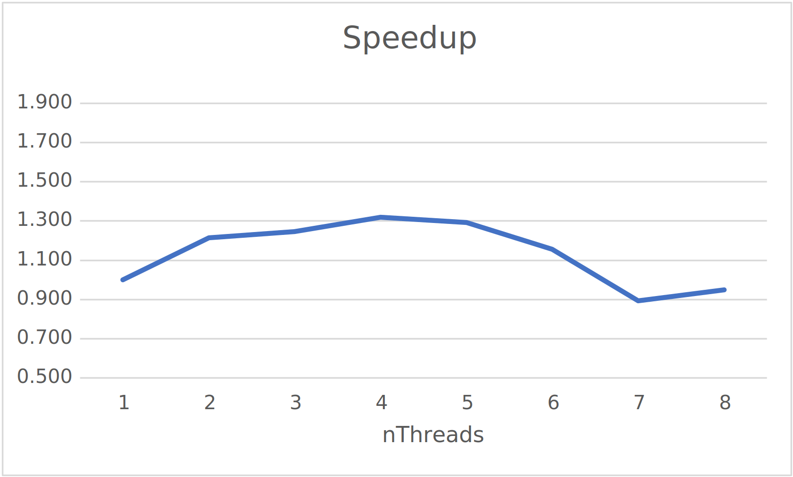
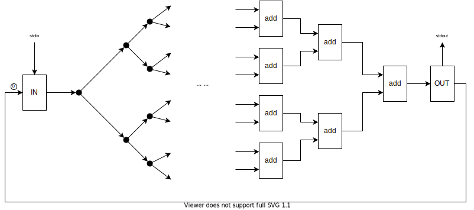
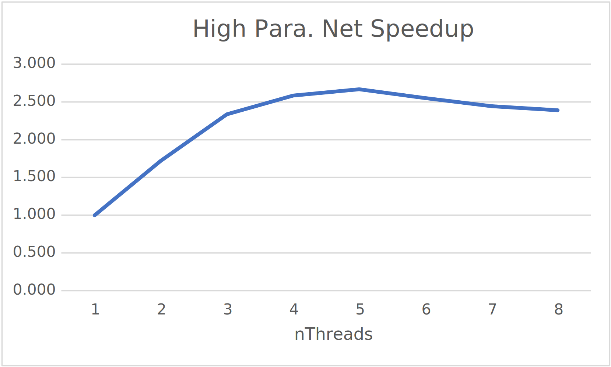

# Report
## Dataflow Network Design
This is a reusable network. Please see [DataflowNetwork.pdf](DataflowNetwork.pdf) 
for the full design, or check out [DataflowNetwork_annotated.pdf](DataflowNetwork_annotated.pdf) 
for more detailed explanations.

Here, I'd like to mention a few points:
1. The __Input__ actor has 1 input channel and 1 output channel. 
   It is also attached to a `InputStream` (hardcoded to be `System.in`).
   When it receives a token from its input channel, it reads a line from 
   the `InputStream` and sends what it read to its output channel.
   
1. The __Output__ actor has 1 input channel and 1 output channel. 
   When it receives a token from its input channel, it prints the token to `System.out`,
   and sends the token to its output channel.
   
1. The network is designed in the way that only after the __Output__ actor prints the
   last token of the "square stream", can the __Input__ actor receive a new token.
   This prevents the channels from being overflowed by the input stream.
   
1. This network represents an iterative process, and most steps are controlled by 
   the same iteration control boolean, so that the channels won't be overflowed by 
   tokens generated from the iterations. To achieve this, the __Add 0__ actor serves 
   as a flow controller. It prevents the iteration control subnet from generating new 
   tokens until the previous step is finished. __(This answers the question in Q1, the explanation)__
   

## Dataflow Simulator Design
An __Actor__ has a `fire()` method, which fires the actor and return `true` if the actor is 
_enabled_, or return `false` otherwise. Actors are added to a static ArrayList 
`Simulation.actors` upon creation.

Actors in `Simulation.actors` are divided and assigned to each thread. When the simulation 
starts, each thread repeatedly calls the `fire()` method of the actors in its sublist.

The simulation terminates when the __Input__ actor reads an EOF from the input stream.

---
Some comments from the developer:

This implementation looks silly, as the threads always poll the actors it manages, while potentially 
lots of them are not enabled, depending on the network. But it actually beats my initial implementation, 
which _looks_ smarter.

So initially, I maintained a shared Actor list `jobs`. When a token is sent to a channel, the 
destination actor is added to `jobs`. Then, there's a thread pool (`ExecutorServiec`) firing the actors 
in the `jobs` list. This eliminates the actors that have received no token from being tried to fire.

However, the overhead of managing the shared list and thread pool is too large for my tiny dataflow 
network. Intuitively, this approach could be more efficient in the following situations:
1. The network is large enough where the data only flows in a small area of the network at a moment, so that the 
   significance of queueing rather than polling is more obvious.
   
1. The actor execution takes a relatively long time, so that the shared list managing overhead is 
   amortized by the multi-thread execution.
   
Since my network does not have these properties, the silly implementation currently in your hand should 
be a better choice.
## Run Test
```
% java Simulation 1 <data.txt >/dev/null
Elapsed time: 2509
% java Simulation 1 <data.txt >/dev/null
Elapsed time: 2501
% java Simulation 1 <data.txt >/dev/null
Elapsed time: 2463
% java Simulation 1 <data.txt >/dev/null
Elapsed time: 2548
% java Simulation 1 <data.txt >/dev/null
Elapsed time: 2522

% java Simulation 2 <data.txt >/dev/null
Elapsed time: 2034
% java Simulation 2 <data.txt >/dev/null
Elapsed time: 2134
% java Simulation 2 <data.txt >/dev/null
Elapsed time: 2014
% java Simulation 2 <data.txt >/dev/null
Elapsed time: 2038
% java Simulation 2 <data.txt >/dev/null
Elapsed time: 2112

% java Simulation 3 <data.txt >/dev/null
Elapsed time: 2083
% java Simulation 3 <data.txt >/dev/null
Elapsed time: 1964
% java Simulation 3 <data.txt >/dev/null
Elapsed time: 2000
% java Simulation 3 <data.txt >/dev/null
Elapsed time: 2024
% java Simulation 3 <data.txt >/dev/null
Elapsed time: 1991

% java Simulation 4 <data.txt >/dev/null
Elapsed time: 1890
% java Simulation 4 <data.txt >/dev/null
Elapsed time: 1920
% java Simulation 4 <data.txt >/dev/null
Elapsed time: 1901
% java Simulation 4 <data.txt >/dev/null
Elapsed time: 1918
% java Simulation 4 <data.txt >/dev/null
Elapsed time: 1884

% java Simulation 5 <data.txt >/dev/null
Elapsed time: 1955
% java Simulation 5 <data.txt >/dev/null
Elapsed time: 1935
% java Simulation 5 <data.txt >/dev/null
Elapsed time: 1905
% java Simulation 5 <data.txt >/dev/null
Elapsed time: 1968
% java Simulation 5 <data.txt >/dev/null
Elapsed time: 1933

% java Simulation 6 <data.txt >/dev/null
Elapsed time: 2111
% java Simulation 6 <data.txt >/dev/null
Elapsed time: 2211
% java Simulation 6 <data.txt >/dev/null
Elapsed time: 2211
% java Simulation 6 <data.txt >/dev/null
Elapsed time: 2143
% java Simulation 6 <data.txt >/dev/null
Elapsed time: 2163

% java Simulation 7 <data.txt >/dev/null
Elapsed time: 2829
% java Simulation 7 <data.txt >/dev/null
Elapsed time: 2802
% java Simulation 7 <data.txt >/dev/null
Elapsed time: 2858
% java Simulation 7 <data.txt >/dev/null
Elapsed time: 2708
% java Simulation 7 <data.txt >/dev/null
Elapsed time: 2837

% java Simulation 8 <data.txt >/dev/null
Elapsed time: 2740
% java Simulation 8 <data.txt >/dev/null
Elapsed time: 3015
% java Simulation 8 <data.txt >/dev/null
Elapsed time: 2756
% java Simulation 8 <data.txt >/dev/null
Elapsed time: 2379
% java Simulation 8 <data.txt >/dev/null
Elapsed time: 2321

% cat data.txt
100000
10
4
1
```
<sup>Well, the data `100000` gives you some negative outputs due to 
integer overflow... I found it out afterwards, but it doesn't really 
matter in terms of performance test.</sup>

<table>
<thead>
  <tr>
    <th>nThreads</th>
    <th>1</th>
    <th>2</th>
    <th>3</th>
    <th>4</th>
    <th>5</th>
    <th>6</th>
    <th>7</th>
    <th>8</th>
  </tr>
</thead>
<tbody>
  <tr>
    <td>Run 1</td>
    <td>2509</td>
    <td>2034</td>
    <td>2083</td>
    <td>1890</td>
    <td>1955</td>
    <td>2111</td>
    <td>2829</td>
    <td>2740</td>
  </tr>
  <tr>
    <td>Run 2</td>
    <td>2501</td>
    <td>2134</td>
    <td>1964</td>
    <td>1920</td>
    <td>1935</td>
    <td>2211</td>
    <td>2802</td>
    <td>3015</td>
  </tr>
  <tr>
    <td>Run 3</td>
    <td>2463</td>
    <td>2014</td>
    <td>2000</td>
    <td>1901</td>
    <td>1905</td>
    <td>2211</td>
    <td>2858</td>
    <td>2756</td>
  </tr>
  <tr>
    <td>Run 4</td>
    <td>2548</td>
    <td>2038</td>
    <td>2024</td>
    <td>1918</td>
    <td>1968</td>
    <td>2143</td>
    <td>2708</td>
    <td>2379</td>
  </tr>
  <tr>
    <td>Run 5</td>
    <td>2522</td>
    <td>2112</td>
    <td>1991</td>
    <td>1884</td>
    <td>1933</td>
    <td>2163</td>
    <td>2837</td>
    <td>2321</td>
  </tr>
  <tr>
    <td>Average</td>
    <td>2509</td>
    <td>2066</td>
    <td>2012</td>
    <td>1903</td>
    <td>1939</td>
    <td>2168</td>
    <td>2807</td>
    <td>2642</td>
  </tr>
  <tr>
    <td>Speedup</td>
    <td>1.000</td>
    <td>1.214</td>
    <td>1.247</td>
    <td>1.319</td>
    <td>1.294</td>
    <td>1.157</td>
    <td>0.894</td>
    <td>0.949</td>
  </tr>
</tbody>
</table>



A maximum speedup of _1.319x_ is observed when running with 4 threads on my 4-core machine.

Further increase of nThreads beyond 8 would be meaningless, as my machine only has 4 cores 
(with Hyper-Threading enabled). So, it's expected that increasing nThreads will not cause performance 
improvement but only add up overhead. As specified in the assignment sheet, I did start 
a test with 41 (no. of actors) threads, before I started making the graph above a few minutes ago, 
and it's still running now... (I'm terminating it.)

There's only _a little bit_ speedup simulating my dataflow network with multiple threads. This is 
because this dataflow network is essentially mostly sequential. As you can see in the graph
[DataflowNetwork.pdf](DataflowNetwork.pdf), only in a few cases are there multiple actors ready to fire.
Therefore, the speedup is subtle for this network.

---
If you try out networks with higher degrees of parallelism _(an example is provided in the code as comment)_, you can 
observe a more obvious speedup.

Example:


Test:
```
% cat data2.txt
10
% java Simulation <nThreads> <data2.txt >/dev/null
```
<table>
<thead>
  <tr>
    <th>nThreads</th>
    <th>1</th>
    <th>2</th>
    <th>3</th>
    <th>4</th>
    <th>5</th>
    <th>6</th>
    <th>7</th>
    <th>8</th>
  </tr>
</thead>
<tbody>
  <tr>
    <td>Run 1</td>
    <td>1514</td>
    <td>889</td>
    <td>631</td>
    <td>582</td>
    <td>557</td>
    <td>595</td>
    <td>618</td>
    <td>645</td>
  </tr>
  <tr>
    <td>Run 2</td>
    <td>1521</td>
    <td>858</td>
    <td>677</td>
    <td>579</td>
    <td>554</td>
    <td>598</td>
    <td>617</td>
    <td>612</td>
  </tr>
  <tr>
    <td>Run 3</td>
    <td>1494</td>
    <td>872</td>
    <td>640</td>
    <td>582</td>
    <td>575</td>
    <td>582</td>
    <td>630</td>
    <td>634</td>
  </tr>
  <tr>
    <td>Run 4</td>
    <td>1490</td>
    <td>865</td>
    <td>630</td>
    <td>582</td>
    <td>553</td>
    <td>581</td>
    <td>603</td>
    <td>626</td>
  </tr>
  <tr>
    <td>Run 5</td>
    <td>1485</td>
    <td>883</td>
    <td>635</td>
    <td>581</td>
    <td>574</td>
    <td>584</td>
    <td>606</td>
    <td>623</td>
  </tr>
  <tr>
    <td>Average (ms)</td>
    <td>1501</td>
    <td>873</td>
    <td>643</td>
    <td>581</td>
    <td>563</td>
    <td>588</td>
    <td>615</td>
    <td>628</td>
  </tr>
  <tr>
    <td>Speedup</td>
    <td>1.000</td>
    <td>1.718</td>
    <td>2.336</td>
    <td>2.582</td>
    <td>2.668</td>
    <td>2.552</td>
    <td>2.441</td>
    <td>2.390</td>
  </tr>
</tbody>
</table>


